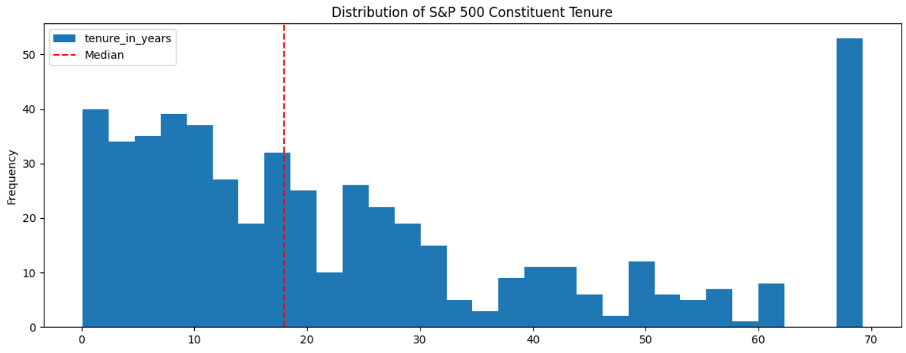
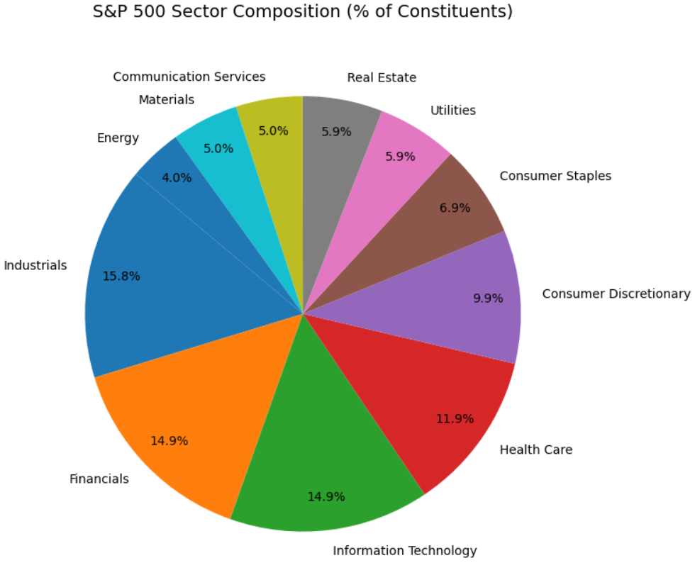
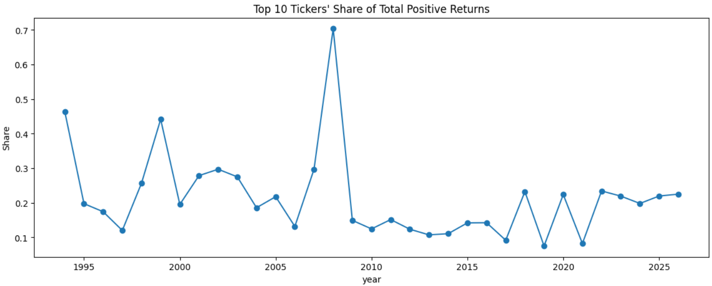
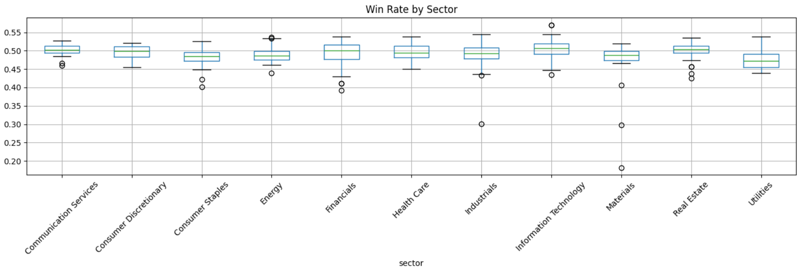
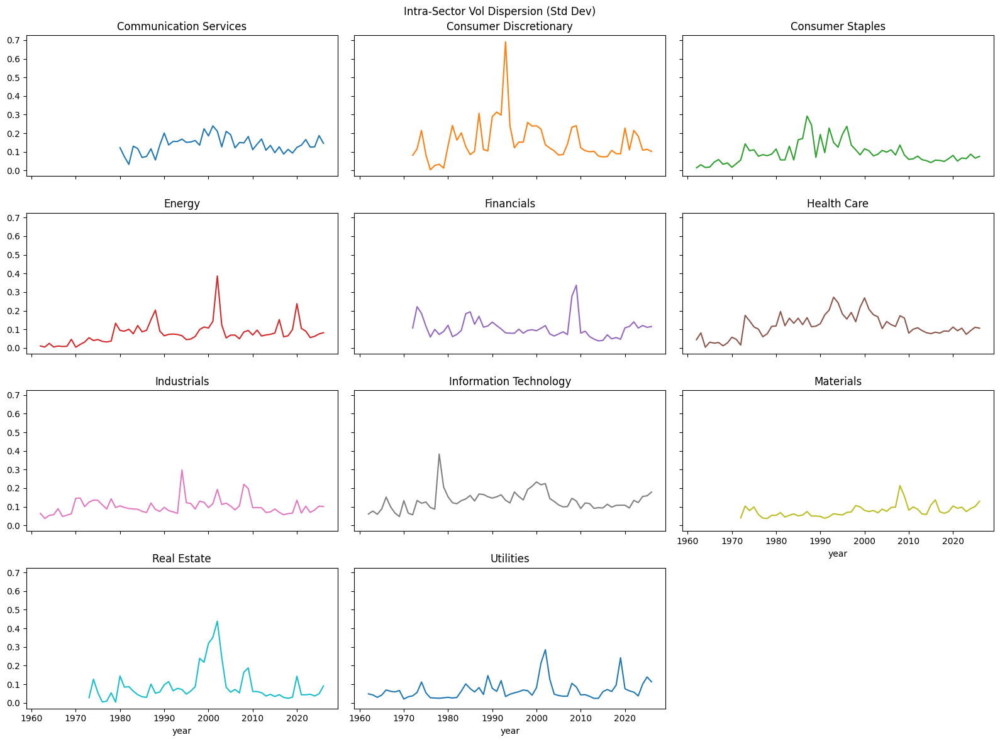

# S&P 500 Constituent Analysis

An end-to-end analytics pipeline that scrapes, transforms, and models S&P 500 constituent data to answer questions about index composition, return concentration, and individual stock performance over time.

Built with Python, DuckDB, and dbt.

## What It Does

The pipeline ingests three datasets: current S&P 500 constituents, historical membership changes, and daily price history for all current and former members. Then, transforms them through a staging → intermediate → mart layer to produce analytical tables covering:

1. **Constituent tenure**: How long has each stock been in the index?

2. **Annualised volatility**: How has each constituent's volatility changed year over year?

3. **Gain/loss ratio**: How do average up-day returns compare to average down-day returns?
1
4. **Return concentration**: How concentrated are total positive returns among the top 10 tickers, and what share of constituents beat the SPY benchmark each year?

5. **Sector composition**: How is the current index weighted across GICS sectors?

6. **Win rate**: What fraction of trading days were positive for each ticker?

## Findings

Note: This analysis uses current S&P 500 constituents only, applied historically. A full historical reconstruction would require point-in-time membership data, which isn't publicly available in clean form.

The S&P 500 is treated as shorthand for "the market", a diversified basket of America's largest companies. But is it really?


Tickers in the index often changes more often than it seems. The median constituent has been in for about 20 years, with most tenures under 15. However, a small exceptional group of names has been there since the 1960s.


The sector breakdown is also surprisingly concentrated. Nearly half of current constituents (46%) sit in just three sectors: Industrials, Financials, and Information Technology. Implicity, buying the S&P 500 is a sector bet whether unintended or not.


Returns are similarly concentrated. The top 10 tickers typically capture 10–30% of all positive returns in a given year, with that figure spiking to ~70% in 2008. In most recent years, fewer than half of constituents actually beat the average returns of SPY


What's interesting is that the outperformers don't win more frequently, like we normally expect. The number of green days sit at around 50% across all sectors. The concentration comes entirely from magnitude: a handful of names in Tech and Health Care collect disproportionately large returns when they do win.


Volatility tells the same story. Tech, Energy, and Consumer Discretionary are consistently the most volatile sectors, and that ranking barely shifts year to year. During downturns, dispersion within those sectors spikes, but the risk stays concentrated in the same few names.

The S&P 500 looks like broad market exposure. In practice it's a high-turnover portfolio where a small number of sectors and an even smaller number of stocks within those sectors drive most of the returns and most of the risk.

## Key Implementation Details

**Tenure reconstruction** (`int_snp500_tenure_event_log_constructed.sql`)

Tenure spans aren't stored directly, and have to be reconstructed from the raw changes history. Therefore, two edge cases need handling before the spans can be built:
- Tickers that only appear as removals are assumed to have entered at index inception (1957-03-04)
- Tickers whose last event is an entry are still in the index today, handled via `stg_snp500_current_constituents`

```sql
first_event_exit as (
    select
        ticker,
        cast('1957-03-04' as date) as start_date,
        event_date as end_date
    from {{ ref('int_snp500_tenure_event_log_ordered') }}
    where event = 2 and event_order = 1
),

remaining_event as (
    select event_date, ticker, event
    from {{ ref('int_snp500_tenure_event_log_ordered') }}
    where not (
        (event = 2 and event_order = 1)
        or (event = 1 and event_order = max_event_order)
    )
)
```

**Log returns** (`int_snp500_daily_return.sql`)

Daily returns are calculated as log returns rather than percentage changes. Log returns are additive across time and closer to normally distributed, which makes them better suited for the volatility and win rate calculations downstream.

```sql
ln(adj_close / lag(adj_close) over (partition by ticker order by date asc)) as daily_return
```

## Project Structure

```
├── ingest/                          # Python scrape scripts (raw → DuckDB)
│   ├── scrape_01_wikipedia.py       # Current constituents + changes history
│   ├── scrape_02_yfinance_tickers.py  # Daily prices for all tickers (incremental)
│   ├── scrape_03_yfinance_spy.py    # Daily prices for SPY (incremental)
│   └── check_01.py                  # Post-ingest data quality checks
├── models/
│   ├── staging/                     # Clean + rename raw tables
│   ├── intermediate/                # Reusable building blocks (tenure spans, returns)
│   └── mart/                        # Final analytical tables
├── data/                            # DuckDB warehouse (gitignored)
├── main.py                          # Orchestrator: ingest → check → dbt run
├── project_config.py                # Shared DB path config
├── dbt_project.yml
└── requirements.txt
```

## Setup

### Prerequisites

1. Python 3.10+
2. pip

```bash
git clone https://github.com/Winisition/SPY500_Constituent_Analysis
cd SPY500_Constituent_Analysis
pip install -r requirements.txt
```

### Configure dbt

A `profiles.yml.example` is included in the repo. Copy it to `~/.dbt/profiles.yml` and replace `<absolute-path-to-project>` with the full path to your cloned repo.

## Usage

### Run the full pipeline

```bash
python main.py
```

This runs all ingest scripts, data quality checks, and then `dbt run` in sequence.

### Run individual steps

```bash
python ingest/scrape_01_wikipedia.py
python ingest/scrape_02_yfinance_tickers.py
python ingest/scrape_03_yfinance_spy.py
python ingest/check_01.py
dbt run
```

The price scripts are incremental — first run fetches full history, subsequent runs fetch only new data.

## Data Sources

| Source | Table | Description |
|--------|-------|-------------|
| Wikipedia | `snp500_current_constituents` | Current S&P 500 members with sector, date added |
| Wikipedia | `snp500_changes_history` | Historical additions and removals |
| Yahoo Finance | `snp500_raw_prices` | Daily OHLCV for all current + historical tickers |
| Yahoo Finance | `snp500_spy_prices` | Daily OHLCV for SPY ETF (index benchmark) |

## dbt model lineage

```

stg_raw_prices ───────────┐
stg_current_constituents ─┤─► int_current_constituent_prices
                          │     ├─► int_daily_return
                          │     │     ├──● mart_annualised_volatility
                          │     │     ├──● mart_win_rate
                          │     │     └──● mart_gain_loss_ratio
                          │     └─► int_constituent_returns (+ int_spy_returns)
                          │           └──● mart_return_concentration (+ int_spy_returns)
                          │
stg_spy_prices ───────────┴─► int_spy_returns

stg_changes_history ──────── int_tenure_event_log_base
                               └─► int_tenure_event_log_ordered
                                     └─► int_tenure_event_log_constructed ──┐
stg_current_constituents ──── int_tenure_current_constituents ──────────────┤
                          └──● mart_sector_composition                      │
                                                              └──● mart_current_constituent_tenure
```

## Tech Stack

1. **Python** — ingestion, orchestration
2. **DuckDB** — warehouse
3. **dbt-duckdb** — transformation layer (staging → intermediate → mart)
4. **yfinance** — daily price data
5. **pandas** — data wrangling

## Limitations

1. **Survivorship bias on prices.** About 23% of historical S&P 500 constituents have no price data on Yahoo Finance. They are possibly genuine delistings like bankruptcies and acquisitions from before 2015. All price-derived metrics exclude these tickers, so results skew toward companies that survived.

2. **yfinance reliability.** Yahoo Finance rate-limits scrapers and occasionally blocks them entirely. The endpoints can change without notice. If you're running this repeatedly or in production, stooq is more dependable.

3. **Pre-1957 tenure assumption.** Tickers that show up in the changes log only as removals without a matching adding ticker are assumed to have been in the index since inception (March 4, 1957). This overstates their tenure if they actually joined later but the changes log did not capture it.

4. **Wikipedia data quality.** The constituent and changes tables are community maintained. There are likely missing events, and are not cross-validated against S&P's official records.

5. **Sector classification is a point-in-time snapshot.** Every ticker gets its current GICS sector from Wikipedia, and historical reclassifications aren't tracked. Therefore, sector-level metrics treat today's classification as if it never changed.

6. **Date parsing assumes consistent formatting.** The changes log is parsed with `strptime('%B %d, %Y')`. Assumes Wikipedia's date format is consistent across all 394 change rows. Edge cases (e.g., "circa 1990" or unusual formatting) fail silently if they exist.

## What's next

1. **Switch price ingestion to stooq** for reliability, yfinance's rate limiting makes reproducing the pipeline risky in the future

2. **Add the "index inclusion effect" KPI** Does being added to the S&P 500 actually move a stock's price?

3. **Add dbt tests** Expand dbt test coverage to intermediate and mart layers beyond the existing tenure test.

4. **Build a Streamlit dashboard** over the marts as a presentation layer

